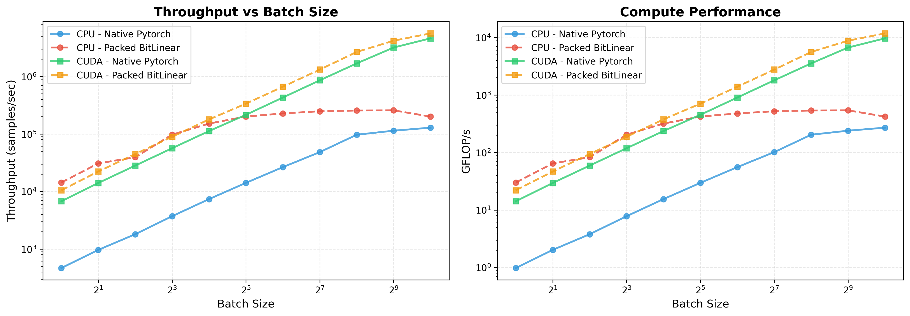

# BitLinear

Efficient BitLinear implementation with CPU and CUDA support for PyTorch.

## Description

BitLinear is a binary neural network linear layer implementation that quantizes weights to ternary values `{-1, 0, 1}` and activations to int8. This package provides optimized CPU and CUDA kernels for efficient inference.

## Features

- **CPU and CUDA support**: Optimized kernels for both CPU (with OpenMP) and CUDA
- **Training and deployment modes**: Supports both training with gradient flow and efficient inference
- **Flexible quantization**: Configurable quantization types for different use cases
- **PyTorch integration**: Seamless integration with PyTorch's `nn.Module` API

## Performance

### Latency Comparison


### Throughput Comparison



### Static Memory


## Quick Start

```bash
# 1. Clone the repository
git clone https://github.com/OliverGrainge/bitlinear.git
cd bitlinear

# 2. Install and build kernels (editable mode recommended)
pip install -e .

# 3. Verify the kernels were built
python -c "import _bitlinear; print('✓ Kernels built successfully!')"
```

**Note:** The kernels are compiled automatically during installation. If the verification step fails, see [Troubleshooting Build Issues](#troubleshooting-build-issues) below.

## Installation

### Prerequisites

Before installing, ensure you have:

- **Python** >= 3.7
- **PyTorch** >= 1.13.0 (install from [pytorch.org](https://pytorch.org/get-started/locally/))
- **C++ compiler**:
  - Linux: `gcc` or `clang` (usually pre-installed)
  - macOS: Xcode Command Line Tools (`xcode-select --install`)
  - Windows: Visual Studio Build Tools or MSVC
- **CUDA toolkit** (optional, for GPU support)
- **OpenMP** (for CPU parallelization, usually included with compiler)
  - macOS: `brew install libomp` (if not using system OpenMP)

### Building the Kernels

**⚠️ IMPORTANT:** This package requires compiling C++/CUDA kernels. The kernels are **NOT** pre-built and must be compiled during installation.

#### Quick Start (Recommended)

**For development (editable install - automatically builds kernels):**
```bash
git clone https://github.com/OliverGrainge/bitlinear.git
cd bitlinear
pip install -e .
```

**For regular installation:**
```bash
git clone https://github.com/OliverGrainge/bitlinear.git
cd bitlinear
pip install .
```

When you run `pip install .` or `pip install -e .`, the build process should automatically:
1. Detect if CUDA is available (via PyTorch)
2. Compile CPU kernels (always)
3. Compile CUDA kernels (if CUDA is available)
4. Build the `_bitlinear` extension module

You should see build output like:
```
Building BitLinear with CUDA support
============================================================
CUDA version: 12.0
Sources: 2 CPU + 1 CUDA files
============================================================
```

Or for CPU-only:
```
Building BitLinear with CPU-only support
============================================================
CUDA not available - skipping GPU kernels
Sources: 2 CPU files
============================================================
```

#### Verify the Kernels Were Built

**After installation, ALWAYS verify the extension was built:**

```bash
python -c "import _bitlinear; print('✓ Kernels built successfully!')"
```

If this command fails with `ModuleNotFoundError: No module named '_bitlinear'`, the kernels were **not** built. See troubleshooting below.

#### Manual Kernel Compilation

If `pip install .` didn't build the kernels (or you want to rebuild them), use one of these methods:

**Method 1: Build extension in-place (recommended for development)**
```bash
python setup.py build_ext --inplace
```

**Method 2: Install in editable mode (automatically compiles)**
```bash
pip install -e .
```

**Method 3: Clean rebuild**
```bash
# Clean previous builds
rm -rf build dist *.egg-info

# Rebuild
pip install -e .
```

#### CPU-only Build

To skip CUDA compilation (faster build, CPU-only):

```bash
# Set environment variable before building
export BITLINEAR_FORCE_CPU=1
pip install -e .
```

Or in one command:
```bash
BITLINEAR_FORCE_CPU=1 pip install -e .
```

#### Install from GitHub (Direct)

You can also install directly from GitHub:

```bash
pip install git+https://github.com/OliverGrainge/bitlinear.git
```

**Note:** This should also build the kernels automatically, but if it doesn't, you'll need to clone the repo and build manually (see above).

### Troubleshooting Build Issues

If the kernels didn't build or you see import errors:

1. **Check PyTorch is installed:**
   ```bash
   python -c "import torch; print(f'PyTorch {torch.__version__}')"
   ```

2. **Verify C++ compiler:**
   ```bash
   # Linux/macOS
   gcc --version
   # or
   clang --version
   ```

3. **Check build output:** Look for compilation errors in the `pip install` output. Common issues:
   - Missing compiler
   - Missing OpenMP (macOS: `brew install libomp`)
   - CUDA version mismatch
   - PyTorch version incompatibility

4. **Force a clean rebuild:**
   ```bash
   rm -rf build dist *.egg-info
   pip install -e . --no-cache-dir
   ```

5. **Check if extension exists:**
   ```bash
   # Find where it was installed
   python -c "import sys; print(sys.path)"
   # Look for _bitlinear*.so (Linux/macOS) or _bitlinear*.pyd (Windows)
   ```

6. **Build with verbose output:**
   ```bash
   pip install -e . -v
   ```

7. **macOS runtime linking issues:** If you get `Library not loaded: @rpath/libc10.dylib` errors on macOS:
   
   The extension was built but can't find PyTorch libraries at runtime. This is a common issue with editable installs on macOS.
   
   **Quick fix using the helper script:**
   ```bash
   ./fix_rpath_macos.sh
   ```
   
   **Manual fix:**
   ```bash
   # Find your PyTorch lib directory:
   PYTORCH_LIB=$(python -c "import torch; from pathlib import Path; print(Path(torch.__file__).parent / 'lib')")
   
   # Find the extension file
   EXT_FILE=$(find . -name "_bitlinear*.so" | head -1)
   
   # Fix the rpath
   install_name_tool -add_rpath "$PYTORCH_LIB" "$EXT_FILE"
   
   # Verify it worked
   python -c "import _bitlinear; print('✓ Success!')"
   ```
   
   **Alternative: Use non-editable install** (often works better on macOS):
   ```bash
   rm -rf build dist *.egg-info
   pip install . --no-cache-dir
   ```
   
   **If the automatic rpath fix in setup.py didn't work**, the helper script should fix it. The custom BuildExtension tries to fix this automatically, but sometimes it needs to be run manually.

## Usage

### Basic Usage

```python
import torch
from bitlinear import BitLinear

# Create a BitLinear layer
layer = BitLinear(in_features=512, out_features=256, bias=True)

# Forward pass (training mode)
x = torch.randn(32, 512)
output = layer(x)
```

### Deployment Mode

For efficient inference, deploy the layer to use optimized kernels:

```python
# Deploy for inference (quantizes and packs weights)
layer.deploy()

# Run inference
with torch.no_grad():
    output = layer(x)
```

### Converting from Standard Linear Layer

```python
from torch import nn
from bitlinear import BitLinear

# Create a standard linear layer
linear = nn.Linear(512, 256)

# Convert to BitLinear
bitlinear = BitLinear.from_linear(linear, quant_type="ai8pc_wpt")
```

## Development

### Building Locally

For development, you can build and test locally:

```bash
# Clean build and test
./build.sh

# Or build manually
pip install -e .
```

### Testing

```bash
pytest test.py
python test_perf.py
```

## License

MIT License

## Contributing

Contributions are welcome! Please feel free to submit a Pull Request.

