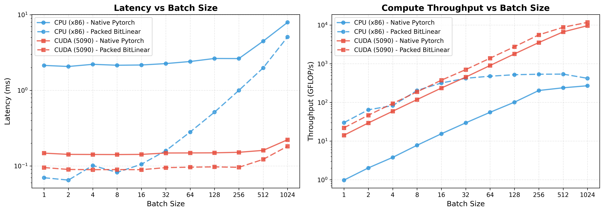
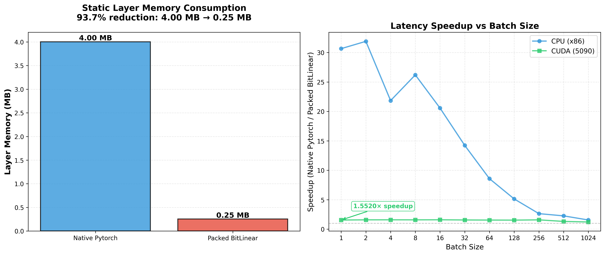

# BitLinear


**BitLinear is a hardware-optimized ternary linear layer for PyTorch**, designed to close the gap between the *theoretical* efficiency of ternary networks and their *practical* realized performance on modern CPUs and GPUs.

```python
# Simply replace nn.Linear with BitLinear
from bitlinear import BitLinear
layer = BitLinear(512, 256)  # drop-in replacement for nn.Linear(512, 256)
```

Ternary networks—using weights in `{−1, 0, +1}`—have been shown in work such as **BitNet**, **Spectra**, and **TeTRA-VPR** to preserve FP16/BF16-level accuracy while offering dramatic theoretical reductions in memory footprint and bandwidth use.  

In standard frameworks, however, these advantages vanish: PyTorch expands ternary weights back to 8- or 16-bit formats, eliminating actual speedups and bloating memory traffic.

**BitLinear fixes this.**  
It introduces **true 2-bit weight packing** and **custom CPU/GPU kernels** that operate directly on packed ternary weights—yielding real, measurable gains in latency, throughput, and model size.

---

## Highlights

- **True 2-bit weight storage**  
  No expansion to 8/16-bit tensors at runtime.

- **Hardware-specialized kernels**  
  - ARM **NEON**, **NEON-DotProd**  
  - x86 **AVX2**, **AVX-VNNI**, **AVX512-VNNI**  
  - CUDA **bit-packed GPU kernels**

- **End-to-end PyTorch integration**  
  Drop-in `nn.Module` replacement; no custom graph rewrites.

- **Training-friendly**  
  Works with standard QAT pipelines—no need to hand-implement ternary quantizers or STE logic.

- **Deployment-ready operator**  
  Fused, bandwidth-efficient inference kernels for CPU and GPU.

---

## Performance

### Latency

The kernels are engineered for low-latency inference through aggressive vectorization, bit-packing, and reduced memory traffic.


---

### Static Memory Footprint

BitLinear reduces the effective layer memory by **~94%**, enabling significantly higher model density on-device.



---

## Installation

### Requirements
- Python ≥ 3.7  
- PyTorch ≥ 1.13  
- C++17 compiler (gcc/clang/MSVC)  
- CUDA Toolkit (optional, for GPU support)  
- OpenMP (for parallel CPU kernels)

### Editable Install (recommended)

```bash
git clone https://github.com/OliverGrainge/bitlinear.git
cd bitlinear
pip install -e .
```

### Verify Kernel Build

```bash
python -c "import _bitlinear; print('✓ Kernels built successfully!')"
```

---

## Usage

### Basic Example

```python
import torch
from bitlinear import BitLinear

layer = BitLinear(512, 256, bias=True)
x = torch.randn(32, 512)

out = layer(x)
```

### Quantization-Aware Training (QAT)

BitLinear works seamlessly with standard PyTorch training pipelines. During training, the layer quantizes weights and activations on-the-fly while preserving gradient flow through the straight-through estimator (STE). Simply use it like any other `nn.Module`:

```python
import torch
import torch.nn as nn
from bitlinear import BitLinear

# Replace nn.Linear with BitLinear in your model
model = nn.Sequential(
    BitLinear(512, 256),
    nn.ReLU(),
    BitLinear(256, 128),
)

# Train normally - gradients flow through quantization
optimizer = torch.optim.Adam(model.parameters())
loss_fn = nn.MSELoss()

for x, y in dataloader:
    optimizer.zero_grad()
    out = model(x)
    loss = loss_fn(out, y)
    loss.backward()  # Gradients computed normally
    optimizer.step()
```

### Deployment Mode

After training, call `deploy()` to optimize the layer for inference. This method:
1. **Quantizes and packs weights** into a 2-bit representation (4 weights per byte)
2. **Removes the original FP32 parameters** to save memory
3. **Switches to optimized inference kernels** that operate directly on packed weights

Once deployed, the layer uses hardware-optimized kernels for maximum throughput and minimal memory footprint:

```python
# After training, deploy for inference
model.eval()
for layer in model:
    if isinstance(layer, BitLinear):
        layer.deploy()

# Run inference with optimized kernels
with torch.no_grad():
    out = model(x)
```

**Note:** Deployed layers are inference-only and cannot be trained further. The original parameters are replaced with packed buffers.

### Converting from a Standard Linear Layer

You can convert an existing `nn.Linear` layer to `BitLinear`:

```python
from torch import nn
from bitlinear import BitLinear

dense = nn.Linear(512, 256)
ternary = BitLinear.from_linear(dense)
```

---

## Development

### Build locally

```bash
./build.sh
pip install -e .
```

### Tests

```bash
pytest test.py
python test_perf.py
```

---

## Troubleshooting

- Ensure PyTorch is installed with matching CUDA version  
- Confirm compiler availability  
- Use `pip install -vvv .` for verbose build logs  
- Delete old build artifacts:
  ```bash
  rm -rf build/ dist/ bitlinear.egg-info/
  ```

---

## License
**MIT License**

## Contributing
Pull requests are welcome—please open an issue first for major changes.